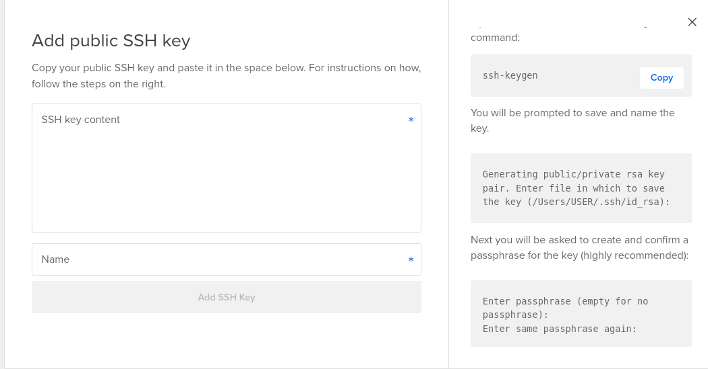

### Linux server setup

- i am assuming you have working with debian based linux distro like ubuntu or mint.

- first step is to get the server up and running. i am using [digital ocean](https://www.digitalocean.com/) for this. you can use any cloud provider like aws, google cloud, linode etc.

- when you are try to lunch a new server , you will option to choose the authentication method ssh key is the best option.

- to setup ssh key we have to pest our public key to the server.

- so we have to generate ssh key pair in our local machine. to do that open terminal and type the following command.

```sh
ssh-keygen
```

- this command will prompt you to enter a file name for the key pair like this. you can leave it blank and press enter to use the default file name. but if you are using multiple ssh key pair then you have to give a unique name for each key pair.

```sh
Enter file in which to save the key (/home/jay/.ssh/id_rsa): 
```

- i am giving the name `server` for this key pair. so the file name will be `server` and `server.pub`.

```sh
Enter file in which to save the key (/home/jay/.ssh/id_rsa): /home/jay/.ssh/server
```

- next it will ask you to enter a passphrase. you can leave it blank and press enter to skip this step. but if you want to add a passphrase then enter a strong passphrase and press enter. this passphrase will be used to encrypt your private key. so you have to enter this passphrase every time you use this key pair to login to the server.

- here i am not using any passphrase. so i am leaving it blank and pressing enter.

- now public and private key pair is generated. you can find the public key in the file `server.pub` and private key in the file `server` under the directory `~/.ssh/`.

- public key work like a lock and private key work like a key. so you have to keep your private key safe and secure. if you lost your private key then you can't access the server.

- now copy your public key content and pest in prompt of the server setup. the prompt will look like below in digital ocean.



- you can find the public key content by typing the following command in terminal copy and pests the content in ssh-key-content and give the name like server.

```sh
cat ~/.ssh/server.pub
```
- after adding this key you can launch your machine.

- now it's time to ssh into machine. using the following command.

```sh
ssh root@<ip-address>
```

- if above command not work for you then you can specify the private key file using `-i` option.

```sh
ssh -i ~/.ssh/server root@<ip-address>
```

- after pressing the enter it will ask you to add the server to known host. type `yes` and press enter.

- now you are logged in to the server as root user.

- first thing we can do to our server is to update the packages. to do that type the following command.

```sh
apt-get update
```
- after that we can upgrade the packages using the following command.

```sh
apt-get upgrade
```

- when you are try to upgrade the packages it will ask you to confirm the upgrade. type `y` and press enter.

- while upgrading sometimes services will ask you to restart pink screen will appear. you can press `tab` key to select `ok` and press enter.

- update will update the package list and upgrade will upgrade the packages.

- running the sever as root user is not a good idea. so we have to create a new user and give sudo access to that user.

```sh
adduser <username>
```

- it will ask you to enter a password for the user. enter a strong password and press enter.

- next it will ask you to enter the user details. you can leave it blank and press enter to skip this step.


- now we have to give sudo access to the user. to do that we have to add the user to sudo group.

```sh
usermod -aG sudo <username>
```
## adding ssh key way-1

- now we have to add the public key to the users `authorized_keys` file.
so that we can login to the server using the private key. to do that we have to create a `.ssh` directory and `authorized_keys` file in the users home directory.

```sh
mkdir /home/<username>/.ssh
touch /home/<username>/.ssh/authorized_keys
```

- now we have to copy the public key content and pest in the `authorized_keys` file.

```sh
vi /home/<username>/.ssh/authorized_keys
```

- now we have to change the ownership of the `.ssh` directory and `authorized_keys` file to the user.

```sh
chown -R <username>:<username> /home/<username>/.ssh
```

- now we can login to the server using the new user.

```sh
ssh <username>@<ip-address>
```

- if above command not work for you then you can specify the private key file using `-i` option.

```sh
ssh -i ~/.ssh/server <username>@<ip-address>
```

## adding ssh key way-2

- there is a another way to adding authorized_keys file to the user. you can copy the public key content and pest in the `authorized_keys` file using the following command.

```sh
ssh-copy-id <username>@<ip-address>
```

- if above command not work for you then you can specify the private key file using `-i` option.

```sh
ssh-copy-id -i ~/.ssh/server <username>@<ip-address>
```

- now we can login to the server using the new user.

```sh
ssh <username>@<ip-address>
```

- now we are changing the hostname using below command

```sh
hostnamectl set-hostname dev-server
```

- i am using `dev-server` as hostname. you can use any name you want.

- we have to update /etc/hosts file to reflect the new hostname.

```sh
vi /etc/hosts
```
- add the following line to the file.

```sh
127.0.1.1 dev-server
```

- this will update the hostname in the prompt.

- now we are disabling root login. to do that we have to edit the ssh config file.

```sh
sudo vi /etc/ssh/sshd_config
```

- find the line `PermitRootLogin yes` and change it to `PermitRootLogin no`.like below (before doing this make sure you have a user with sudo access and you can login to the server using that user.)

```sh
PermitRootLogin no
```

- and as a security measure we can disable password authentication. to do that find the line `PasswordAuthentication yes` and change it to `PasswordAuthentication no`.

```sh
PasswordAuthentication no
```

- now we have to restart the ssh service to reflect the changes.

```sh
sudo systemctl restart ssh
```
- that's it. now we have a secure server. we can add many more security measures to the server. but this is enough for now.

- now on top of this you can install any software you want. and setup your dev or production environment.